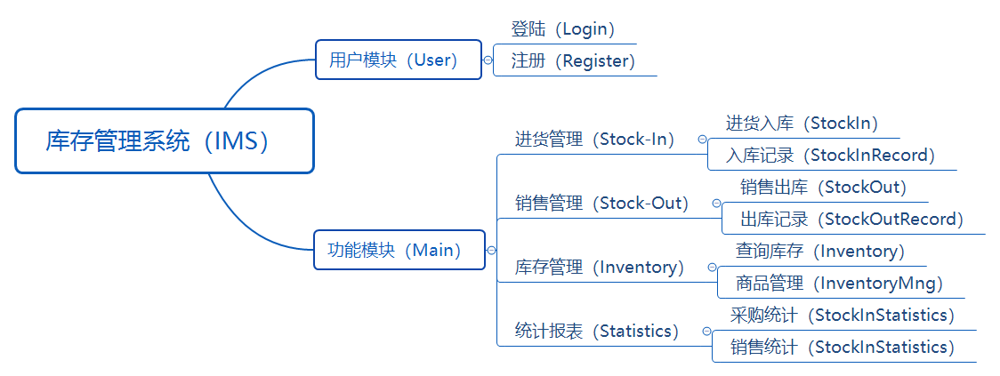

# IMS-进销存管理系统
基于 Java 实现的进销存管理系统（Inventory Management System）

## 项目结构



## 系统功能设计

- **进货管理（Stock-In）**
  - **进货入库（StockIn）**：Btn->Form
  - **入库记录（StockInRecord）**：Table
- **销售管理（Stock-Out）**
  - **销售出库（StockOut）**：Btn->Form
  - **出库记录（StockOutRecord）**：Table
- **库存管理（Inventory ）**
  - **查询库存（Inventory）**：Table
  - **商品管理（InventoryMng）**：Btn->Form
- **统计报表（Statistics）**
  - **商品采购统计（StatisticsStockIn）**：统计图
  - **商品销售统计（StatisticsStockOut）**：统计图

## MVC项目架构

- Model：数据模型层
- View：视图层
- Controller：控制层

```
  View：UI层
    ↑
Controller：控制层
    ↑
 Service：业务逻辑
    ↑
   DAO：底层实现
    ↑
   DB：数据库
```

## GUI设计

```
.
|—— 用户登陆界面(LoginFrame)
|—— 主界面(MainFrame)
	|—— 菜单栏(MenuPanel)：logo，进货管理，销售出库，库存管理，统计报表
	|—— 内容栏(ContentPanel)
		|—— 进货管理(StockInPanel)：入库记录(StockInRecordTable)，进货入库(StockInBtn->Form)
		|—— 销售管理(StockOutPanel)：出库记录(StockOutRecordTable)，销售出库(StockOutBtn->Form)
		|—— 库存管理(InventoryPanel)：查询库存(InventoryTable)，商品管理(InventoryMngBtn->Form)
		|—— 统计报表(StatisticsPanel)：采购统计，销售统计
```

## 数据库设计

用户表user：id (uk)，username，md5(password)；

库存表product：proId (uk)，proName，dirName，supplier，brand，count；

记录表record：date，proId，proName，count，register，recordType；

## 功能实现

**1. 进货管理（Stock-In）**：

- **入库记录表（StockInRecord）**：查询by日期/产品名称/分类；

- **进货入库（StockIn）**：

```
if(新商品在product表中存在){
    商品库存量 += count;
}else{
    插入新商品到product表中;
}
插入一条入库记录到record表中
```

**2. 销售出库（Stock-Out）**：

- **出库记录表（StockInRecord）**：查询by日期/产品名称/分类；

- **销售出库（StockOut）**：

```
if(新商品在product表中存在){
    if(被删除商品的库存数量>出库数量){
        商品库存量 -= count;
    }else{
        提示商品库存不足;
    }
}else{
    商品不存在
}
```

**3. 库存管理（Inventory ）**

- **查询库存（Inventory）**：查询by产品名称/库存范围/分类；
- **商品管理（InventoryMng）**：

```
选中库存表中任意一行
Mng.product = 获取到改行的product对象;
if(选中的product不为空){
   修改商品信息;
   更新product表信息;
   更新record表信息;
}
```

**4. 统计报表（Statistics）**

JFreeChart生成统计图。

**5. 数据导入导出**

基于Apache POI实现的表格数据导出为Excel.xlsx表格。


## 还想实现的功能

手机验证码，邮箱验证码。

验证码验证，滑块验证，文字验证。

时间戳随机生成订单序号。

多角色使用。

多终端使用。

全部检索。

伪删：触发器


## 总结

- 编写开发手册，需求分析+系统设计。
- 编写开发手册，统一命名规则。
- 合作沟通是提升效率的关键。
